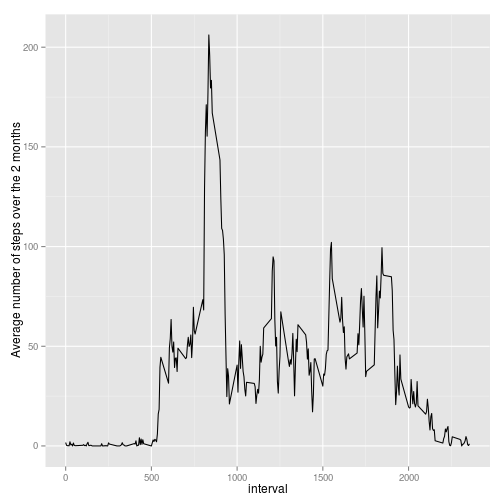
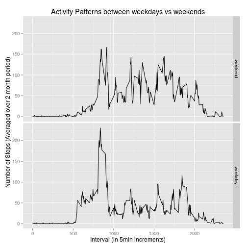

# Reproducible Research: Peer Assessment 1
 

## Loading and preprocessing the data

```r
download.file("http://d396qusza40orc.cloudfront.net/repdata%2Fdata%2Factivity.zip","activity.zip")
unzip("activity.zip",list=T)
```

```
##           Name Length                Date
## 1 activity.csv 350829 2014-02-11 10:08:00
```

```r
unzip("activity.zip")
d <- read.csv("activity.csv",header=T)
```
## What is mean total number of steps taken per day?


```r
steps_taken_per_day <- tapply(d$steps,as.factor(d$date),sum)
hist(steps_taken_per_day)
```

 

```r
mean(steps_taken_per_day,na.rm = T)
```

```
## [1] 10766
```

```r
median(steps_taken_per_day,na.rm = T)
```

```
## [1] 10765
```

Mean: 10766.19
Median: 10765

## What is the average daily activity pattern?


```r
require("ggplot2")
require("plyr")
summary_by_interval <- ddply(d,.(interval),summarize,Total=sum(steps,na.rm=T),Mean=mean(steps,na.rm=T),Median=median(steps, na.rm=T))
qplot(data = summary_by_interval,x=interval, y=Mean,geom = "line", ylab = "Average number of steps over the 2 months")
```

 

```r
# Looking up the 5-minute interval that, on average, contains the maximum number of steps
summary_by_interval$interval[summary_by_interval$Mean == max(summary_by_interval$Mean)]
```

```
## [1] 835
```
The interval 835 has the highest average number of steps across all days for the data.

## Imputing missing values

1. There are 2304 NA values in original dataset

```r
summary(d)
```

```
##      steps               date          interval   
##  Min.   :  0.0   2012-10-01:  288   Min.   :   0  
##  1st Qu.:  0.0   2012-10-02:  288   1st Qu.: 589  
##  Median :  0.0   2012-10-03:  288   Median :1178  
##  Mean   : 37.4   2012-10-04:  288   Mean   :1178  
##  3rd Qu.: 12.0   2012-10-05:  288   3rd Qu.:1766  
##  Max.   :806.0   2012-10-06:  288   Max.   :2355  
##  NA's   :2304    (Other)   :15840
```

2. To 'fill in' the NA values in this dataset, I will use the mean value for the given interval. This will be done by using a for loop to look at each row. For each row, if the steps value is NA, the function will look up the mean value for that interval in a summary table that has the total number or steps, mean, and median calculated for each interval.

3. New dataset with the NA's filled in using the mean for the interval:

```r
summary_by_interval <- ddply(d,.(interval),summarize,Total=sum(steps,na.rm=T),Mean=mean(steps,na.rm=T),Median=median(steps, na.rm=T))

# d2 will be my new table with all NA values replaced with mean values.
d2 <- d
for (i in 1:nrow(d2)) {
  if(is.na(d2[i,1])) {
    d2[i,1] <- summary_by_interval$Mean[summary_by_interval$interval == d2[i,3]]
  }
}
head(d2)
```

```
##     steps       date interval
## 1 1.71698 2012-10-01        0
## 2 0.33962 2012-10-01        5
## 3 0.13208 2012-10-01       10
## 4 0.15094 2012-10-01       15
## 5 0.07547 2012-10-01       20
## 6 2.09434 2012-10-01       25
```

```r
summary(d2)
```

```
##      steps               date          interval   
##  Min.   :  0.0   2012-10-01:  288   Min.   :   0  
##  1st Qu.:  0.0   2012-10-02:  288   1st Qu.: 589  
##  Median :  0.0   2012-10-03:  288   Median :1178  
##  Mean   : 37.4   2012-10-04:  288   Mean   :1178  
##  3rd Qu.: 27.0   2012-10-05:  288   3rd Qu.:1766  
##  Max.   :806.0   2012-10-06:  288   Max.   :2355  
##                  (Other)   :15840
```

4. The difference between the mean and median for the data set with the missing values and the data set without is very small.


```r
# The total number of steps per day using dataset without missing values.
steps_taken_per_day_filled_na <- tapply(d2$steps,as.factor(d2$date),sum)
hist(steps_taken_per_day_filled_na)
```

 

```r
mean(steps_taken_per_day_filled_na)
```

```
## [1] 10766
```

```r
median(steps_taken_per_day_filled_na)
```

```
## [1] 10766
```

```r
# Calculating the difference between the mean and median for the dataset with missing values and the dataset without.
mean(steps_taken_per_day_filled_na) - mean(steps_taken_per_day,na.rm=T) 
```

```
## [1] 0
```

```r
median(steps_taken_per_day_filled_na) - median(steps_taken_per_day,na.rm=T) 
```

```
## [1] 1.189
```


## Are there differences in activity patterns between weekdays and weekends?

Overall, the trend seems to be that this individual moves more durring the weekend. However, looking at movement per interval, this individual moves the most in the morning on weekdays; we might assume this is their walk to work.


```r
require("timeDate")
# d2 is same dataframe as RAW data but with all NA's replaced with mean of interval (See Imputing missing values #3)
d2$typeday <- as.factor(isWeekday(d2$date))
levels(d2$typeday) <- list(weekend = "FALSE", weekday = "TRUE")
qplot(x = interval,y = steps, data = d2 , facets = (typeday~.),geom = "line",stat = 'summary', fun.y = 'mean', main = "Activity Patterns between weekdays vs weekends",xlab = "Interval (in 5min increments)", ylab = "Number of Steps (Averaged over 2 month period)")
```

 

